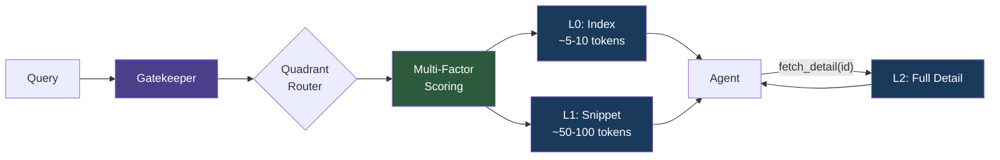
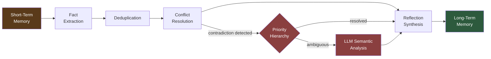

# MemCore

**Tiered memory for AI agents. Remember what matters, forget what doesn't.**

<!-- INSERT: hero-banner.png -->
<!-- Alt text: Dark-themed banner showing "MemCore" in clean sans-serif type with a stylized brain/circuit motif. Tagline reads "Tiered Memory for AI Agents". Subtle gradient from deep navy to black. -->

[](https://python.org)
[](LICENSE)
[](https://modelcontextprotocol.io)
[](https://github.com/BlinkVoid/MemCore)

---

MemCore is a self-hosted memory server for AI agents. It replaces "dump everything into the context window" with a structured retrieval pipeline: tiered disclosure controls token costs, Ebbinghaus-curve decay suppresses stale knowledge, and a consolidation engine with conflict resolution turns raw conversation into durable facts.

Built as an [MCP](https://modelcontextprotocol.io) server. Works with any MCP-compatible client -- Claude, Kimi, Gemini, or your own agent.

---

## Why MemCore?

**Your agent is drowning in context.**
Most memory systems return full content on every query, burning tokens on marginally relevant results. MemCore's tiered disclosure (L0 index / L1 snippet / L2 full detail) saves 40-80% of context tokens by revealing information progressively -- only fetching full detail when the agent explicitly asks for it.

**Memories conflict and nobody notices.**
Users correct themselves. Sources disagree. Preferences change. MemCore applies a six-level priority hierarchy (constraint > correction > verified fact > recent fact > general fact > preference) with LLM-assisted semantic analysis to resolve contradictions automatically. Every conflict is tracked in the graph store for audit. This also acts as a defense layer: prompt injection attempts that try to corrupt your agent's knowledge base are caught and resolved against higher-priority trusted memories.

**Vector search alone isn't enough.**
Cosine similarity finds semantically similar content, but relevance is not just similarity. MemCore scores memories using three factors -- semantic relevance (cosine + BM25), recency (Ebbinghaus forgetting curve), and importance (LLM-assigned) -- with weights that auto-tune based on retrieval feedback.

**Vendor lock-in is unnecessary.**
Embeddings run locally via fastembed (ONNX Runtime). LLM calls go through any supported provider -- Kimi, Bedrock, Gemini, DeepSeek, or Ollama for fully offline operation. Switch providers without re-indexing.

---

## Quick Demo

```
Agent: "What do I know about the user's deployment setup?"

  mem_request(query="user deployment setup")

MemCore returns scored L0/L1 results:
  {
    "quadrant": "coding",
    "memories": [
      {"id": "a1b2c3", "summary": "User runs Kubernetes on AWS EKS, us-east-1", "score": 0.94},
      {"id": "d4e5f6", "summary": "Prefers Terraform over CloudFormation",       "score": 0.87},
      {"id": "g7h8i9", "summary": "Database: PostgreSQL 16 on RDS",              "score": 0.81}
    ]
  }

Agent needs full detail on one memory:
  fetch_detail(memory_id="a1b2c3")

MemCore returns L2 (full content):
  "User's production cluster: EKS 1.29, 3x m6i.xlarge nodes, Istio service mesh,
   ArgoCD for GitOps. Staging mirrors prod at half scale. Last discussed 2026-03-10."
```

Three tokens at L0. Fifty at L1. Full detail only on demand. The agent controls the cost.

---

## Feature Highlights

| Feature | Description |
|---------|-------------|
| **Tiered Disclosure (L0/L1/L2)** | Progressive context revelation -- index, snippet, then full detail on demand |
| **Ebbinghaus Forgetting Curve** | Scientifically-grounded memory decay that naturally deprioritizes stale knowledge |
| **Conflict Resolution** | Six-level priority hierarchy with LLM-assisted semantic analysis and audit trail |
| **STM-to-LTM Consolidation** | Background pipeline: extract facts, deduplicate, resolve conflicts, synthesize reflections |
| **Multi-Factor Scoring** | Relevance (cosine + BM25) + Recency (decay) + Importance (LLM-assigned) |
| **Feedback-Driven Tuning** | Retrieval accuracy tracking auto-adjusts scoring weights over time |
| **Reflection Generation** | Synthesizes higher-order insights from clusters of 3+ related memories |
| **Quadrant Namespacing** | Organize memories by domain (coding, personal, research, instructions) |
| **Local Embeddings** | No API calls for embeddings -- fastembed with ONNX Runtime runs on your machine |
| **MCP Native** | Built as an MCP server; integrates with any MCP-compatible client out of the box |
| **Multilingual** | Supports 100+ languages via multilingual-e5-large embeddings |
| **Dashboard** | Built-in analytics UI for monitoring memory health and retrieval quality |

---

## Architecture

### Retrieval Flow



The agent receives scored summaries first. Full content is fetched only when needed, keeping context windows lean.

### Consolidation Pipeline



Raw conversations are distilled into durable facts through a multi-stage pipeline. Contradictions are caught and resolved before they reach long-term storage.

<!-- INSERT: architecture-diagram.png -->
<!-- Alt text: High-level system diagram showing MemCore's components: MCP Server (SSE/stdio) at the top receiving agent queries, connected to the Gatekeeper (quadrant router + scoring engine), which interfaces with Qdrant (vector store), SQLite (graph store), and the Consolidation Pipeline (STM buffer, fact extraction, dedup, conflict resolution, LTM write). LLM providers (Kimi, Bedrock, Gemini, DeepSeek, Ollama) shown as interchangeable modules on the side. -->

---

## Supported LLM Providers

MemCore uses a two-tier model strategy: **fast** models for classification and routing, **strong** models for extraction and consolidation.

| Provider | Fast Model | Strong Model | Notes |
|----------|------------|--------------|-------|
| **Kimi** (Moonshot) | moonshot-v1-8k | moonshot-v2.5-32k | Best for Chinese/English bilingual |
| **AWS Bedrock** | Claude 3.5 Haiku | Claude 3.5 Sonnet | Enterprise AWS integration |
| **Google Gemini** | Gemini 2.0 Flash | Gemini 2.0 Pro | Google Cloud ecosystem |
| **DeepSeek** | deepseek-chat | deepseek-reasoner | Cost-effective |
| **Ollama** | qwen2.5:7b | qwen2.5:32b | Fully offline, no API keys |

Switch providers by changing one line in `.env`. Embeddings are always local -- provider changes never require re-indexing.

---

## Installation

```bash
# Clone
git clone https://github.com/BlinkVoid/MemCore.git
cd MemCore

# Install dependencies
uv sync

# For SSE server mode (recommended)
uv sync --extra sse

# Configure
cp .env.example .env
# Edit .env: set LLM_PROVIDER and the corresponding API key

# Verify configuration
uv run scripts/verify_config.py

# Run
uv run src/memcore/main.py --mode sse
```

The server starts at `http://127.0.0.1:8080` by default. Health check: `GET /health`.

---

## MCP Configuration

### SSE Mode (Recommended)

Run MemCore as a standalone service. Multiple agents can connect simultaneously.

```bash
uv run src/memcore/main.py --mode sse
```

Client configuration:
```json
{
  "mcpServers": {
    "memcore": {
      "url": "http://127.0.0.1:8080/sse"
    }
  }
}
```

### Stdio Mode

For clients that manage the server process lifecycle:

```json
{
  "mcpServers": {
    "memcore": {
      "command": "uv",
      "args": ["run", "src/memcore/main.py", "--mode", "stdio"]
    }
  }
}
```

### Custom Host and Port

```bash
uv run scripts/run_server.py --host 0.0.0.0 --port 9000
```

---

## MCP Tools

| Tool | Purpose |
|------|---------|
| `mem_request` | Query memories with quadrant hints and context limits. Returns scored L0/L1 results. |
| `mem_rem` | Store new information. Supports immediate LTM write or buffered consolidation. |
| `fetch_detail` | Retrieve L2 full content for a specific memory by ID. |
| `submit_feedback` | Rate retrieval quality. Drives automatic weight optimization. |

---

## How Does MemCore Compare?

MemCore is the only system that combines tiered context disclosure, Ebbinghaus forgetting curves, and priority-based conflict resolution in a single self-hosted package.

See the full comparison against Mem0, Zep, LangChain Memory, LlamaIndex, and raw vector databases in [docs/COMPARISON.md](docs/COMPARISON.md).

---

## Documentation

**Getting Started**
- [Core Concepts](docs/core-concepts.md) -- Scoring equation, tiered disclosure, memory lifecycle
- [API Specification](docs/api-specification.md) -- MCP tool schemas and response formats
- [Data Schema](docs/data-schema.md) -- Storage model and database structure

**Configuration**
- [Embedding Strategy](docs/embedding-strategy.md) -- Local embedding models and trade-offs
- [Multilingual Strategy](docs/multilingual-strategy.md) -- Chinese, English, and 100+ language support
- [Model Tier Strategy](docs/model-tier-strategy.md) -- Fast vs strong model usage per task
- [Local LLM Setup](docs/local-llm-setup.md) -- Running fully offline with Ollama
- [GPU Model Guide](docs/gpu-model-guide.md) -- Hardware recommendations

**Architecture**
- [System Architecture](docs/research-memcore-architecture.md) -- Two-pillar design: precision revelation + gatekept retrieval
- [HIVE Integration](docs/hive-integration.md) -- Using MemCore as shared memory for agent swarms
- [Comparison with Alternatives](docs/COMPARISON.md) -- Honest feature comparison with benchmarks

---

## Contributing

Contributions are welcome. MemCore is a single-developer project, so response times may vary, but every PR and issue gets read.

1. Fork the repository
2. Create a feature branch (`git checkout -b feature/your-feature`)
3. Make your changes
4. Run the config verification: `uv run scripts/verify_config.py`
5. Submit a pull request

For bug reports and feature requests, open an issue on GitHub.

---

## License

[MIT](LICENSE) -- use it however you want.

---

Built by [BlinkVoid](https://github.com/BlinkVoid). If MemCore is useful to you, a star on the repo helps others find it.
